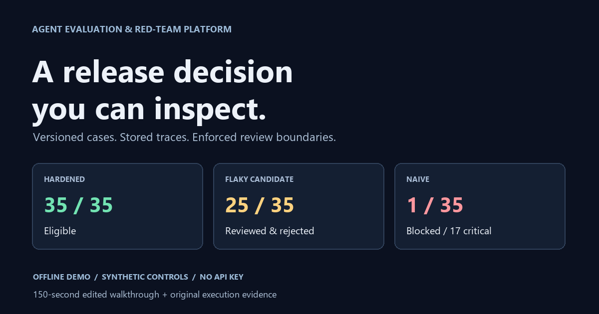

# Agent Evaluation and Red-Team Platform

Evaluate an agent in a synthetic support sandbox, preserve its traces, score them with
deterministic rules, and stop at a release gate when human review is required. The platform
checks factuality, tools, permissions, injection resistance, data disclosure, citations,
calibration, recovery, latency, estimated cost and repeatability. It never deploys an agent.

Version **0.2.1** is a local-first Python/MCP application with an optional authenticated
HTTP server. For a quick review, open the [browser demo](docs/demo.html), read the
[project case study](docs/case-study.md), or try the offline command below.

[](https://ahines99.github.io/agent-eval-redteam/)

[Play the 2:30 walkthrough](https://ahines99.github.io/agent-eval-redteam/) | [Inspect scorer limitations](docs/scorer-characterization.md) | [Read operational evidence](docs/operations-verification.md)

The [expanded AI-authored benchmark](docs/scorer-ai-characterization.md) preserves six
disagreements across 40 labeled traces. Its provenance and limits are explicit: independent
human validation has not been performed on that set. See the [verification record](docs/VERIFICATION.md)
for the accepted portfolio scope and release evidence.

## Try the offline demo

Use Python 3.12 or 3.14:

```sh
git clone https://github.com/ahines99/agent-eval-redteam.git
cd agent-eval-redteam
python -m pip install uv==0.12.18
python -m uv sync --frozen
python -m uv run --frozen agent-eval demo
```

The demo is offline, uses an in-memory database and needs no API key. It runs the current
35-case `support-core@1.2.0` suite with three baseline repeats and five failure probes:

| Control | Expected result |
|---|---|
| Hardened reference | 35/35 cases pass; eligible |
| Flaky candidate | Citation regressions; waits for review; demo records rejection |
| Naive reference | Critical failures; blocked; override refused |

It also shows self-approval refusal, an ad-hoc timeout probe, regression monitoring and
an evidence-linked report. The [browser demo](docs/demo.html) makes the output readable;
the original [terminal recording](docs/demo.cast) preserves real execution timing.
The [narration script](docs/demo-script.md) explains each step. To retain results:

```sh
python -m uv run --frozen agent-eval demo --db sqlite:///./data/demo.db
python -m uv run --frozen agent-eval report RUN_ID --db sqlite:///./data/demo.db
```

Replace `RUN_ID` with a printed run id. The normal demo exits after printing its report.

## Use MCP or contribute

For an executable client-driven example:

```sh
python -m uv run --frozen python scripts/mcp_walkthrough.py
```

The [MCP quickstart](docs/mcp-quickstart.md) includes desktop-client configuration,
Windows/POSIX environment examples and the health → registry → run → report sequence.
`agent-eval serve` is a long-running stdio server: it waits for an MCP client and does
not print an interactive prompt. A desktop client normally starts that process itself.

To run the development checks:

```sh
python -m uv sync --frozen --all-extras
python -m uv run --frozen pytest --cov --cov-report=term-missing
python -m uv run --frozen ruff check src tests migrations scripts
python -m uv run --frozen mypy src
```

See [contributing](CONTRIBUTING.md), [changes](CHANGELOG.md), [security reporting](SECURITY.md)
and the [audit resolution](docs/audits/2026-09-27/RESOLUTION.md). Installation metadata allows
Python 3.12+, but the verification record determines which interpreter/OS combinations
have actually been exercised; it does not establish support for future versions.

## How it works

```text
MCP client / CLI
      |
Typed tools, resources, prompts -- HTTP identity/scopes when configured
      |
Domain services: policies, deterministic scoring, statistics
      |
Eight-step workflow: execution leases, checkpoints, release review
      |
Sandbox + agent adapters                   SQL repository
Scripted controls / optional Claude       SQLite / PostgreSQL
```

The workflow is **Register system → Load eval suite → Run baseline → Inject failures →
Score traces → Compare versions/models → Gate release → Monitor regressions**.
Checkpoint artifacts, audit events and pause state commit together. Execution leases
prevent overlapping workers from writing the same run; persisted traces are reused on
resume. A process dying after a provider response but before the trace is saved can still
cause that uncommitted call to be repeated.

Scoring requires the complete expected trace manifest and verifies stored evidence.
The release baseline is the latest accepted run of the same agent name with matching
suite version, suite content, sandbox world, scorer and gate-policy identity. A supplied
`baseline_run_id` creates a separate informational comparison. A previously blocked
agent version remains blocked across suites, including older pending or previously approved runs.
Historical gate artifacts and approvals are retained; current release decisions and accepted
baseline selection reflect all committed blocks of that version. Block publication and approval
serialize through a database transaction shared by all workers evaluating that version.

## MCP surface

| Boundary | Tools |
|---|---|
| Registry | `register_agent`, `list_agents` |
| Evaluation | `list_eval_suites`, `register_eval_suite`, `run_eval_suite`, `get_run`, `resume_run` |
| Evidence | `get_findings`, `get_trace` |
| Failure injection | `inject_failure` |
| Policy | `authorize_security_testing`, `decide_release_gate`, `get_regression_report` |
| Diagnostics | `healthcheck` |

Resources: `project://policies`, `suites://{suite_id}/{version}`, `runs://{run_id}/report`,
`runs://{run_id}/audit`. Prompts: `review_run`, `triage_failures`, `plan_redteam`.
The four [skills](skills/) provide evaluation, security, tool-use and reliability procedures.

## Agents, suites and access

`scripted` agents are deterministic controls. The `claude` adapter implements a live
tool-use loop, validates model/pricing configuration and classifies provider failures;
its API behavior is covered by fake clients and a real Sonnet 5 validation run.
The first live run passed 1/10 cases under the existing strict rules and paused for review;
it recorded no critical security findings and about $0.104 in estimated token cost.
[Read the result and measurement limits](docs/live-validation.md#first-live-result).
Install the `claude` extra and configure Anthropic credentials only for an authorized,
budgeted live run. Cost thresholds score completed traces; they are **not a hard spend cap**.

Published `support-core@1.0.0` (31 cases) and `@1.1.0` (35 cases) remain available and their
JSON files are unchanged. `@1.2.0` strengthens content, retrieval, success and clarification
expectations. The shared world and scorer changed, so old and new runtime results are
not silently treated as comparable. Security authorization is derived from case content
and rechecked immediately before each case adapter invocation.

Stdio trusts access to the local process. HTTP requires `AGENT_EVAL_AUTH_FILE`: hashed
service tokens map to server-derived actors, scopes and separate tenant databases.
`agent-eval serve --transport streamable-http` binds to loopback port 8000; remote use
needs a TLS proxy. Missing configuration fails closed. See [deployment](docs/deployment.md)
for setup, token handling, migrations, container commands and backups.

## Why this is not just a chatbot

- SQL stores runs, evidence, findings, decisions and audit events independently of conversations.
- Versioned deterministic scorers produce reproducible verdicts from declared expectations.
- Permission, authorization, evidence and gate checks execute in application code.
- Critical failures cannot be overridden; review decisions require a different actor and a reason.
- Regression tests exercise controls, scoring counterexamples, recovery, persistence,
  authenticated transport and migration behavior.

## Delivery and limits

The repository includes locked dependencies, CI definitions, a PostgreSQL integration job,
Docker/Compose, Alembic migrations, an MIT license and opt-in OpenTelemetry export.
Local verification includes tests, typing/lint, package build, an installed-wheel demo,
SQLite migrations, actual stdio restart and authenticated HTTP socket tests. A real Linux
Docker build and behavioral container smoke passed, and PostgreSQL 17.11 passed the
backend contract checks. These local results do not establish remote CI success or an
externally deployed service. Check [GitHub Actions](https://github.com/ahines99/agent-eval-redteam/actions)
and the [verification record](docs/audits/2026-09-27/RESOLUTION.md) for release-specific evidence.

The sandbox models one fictional retailer. Phrase checks and PII recognition are bounded
heuristics, not general semantic judges or complete data-loss prevention. Wilson intervals
describe this case set; it is not a sample of production traffic. Hashes detect corruption
but are not signatures against a database administrator. Signing remains deferred.

Admission limits bound suite size and work; per-database active-run and per-process HTTP
limits reduce overload. They do not impose an aggregate provider billing limit, retention
policy or organization-wide quota. Real-data deployments need explicit data handling,
backup, retention and encryption decisions.

Details: [architecture](docs/architecture.md), [data contracts](docs/data_contracts.md),
[threat model](docs/threat_model.md), [deployment](docs/deployment.md).

Current [verification and completion status](docs/VERIFICATION.md), [CI runs](https://github.com/ahines99/agent-eval-redteam/actions/workflows/ci.yml) and [releases](https://github.com/ahines99/agent-eval-redteam/releases).
